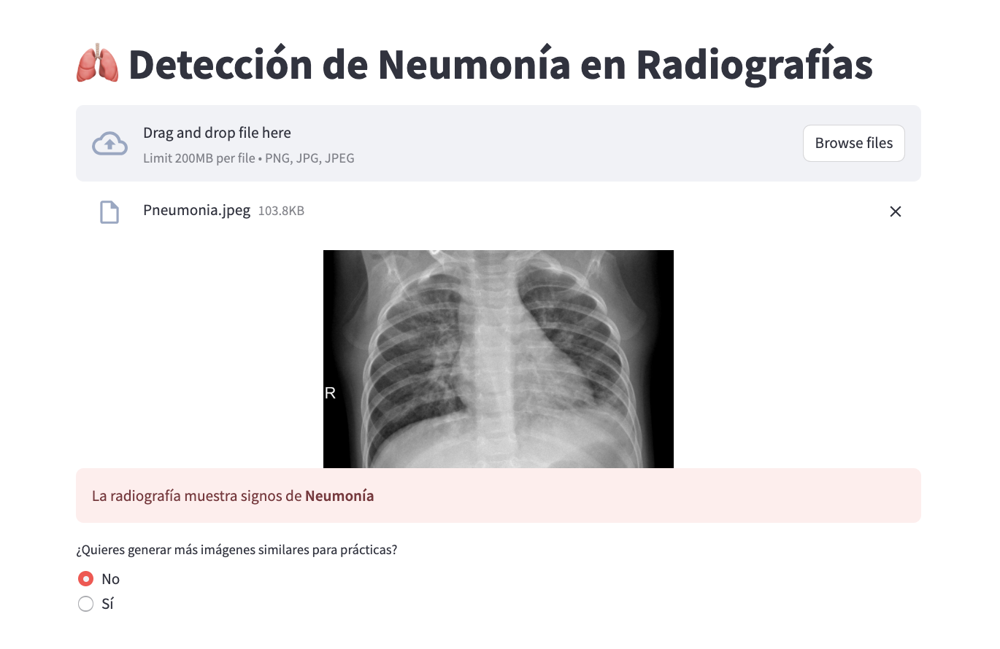
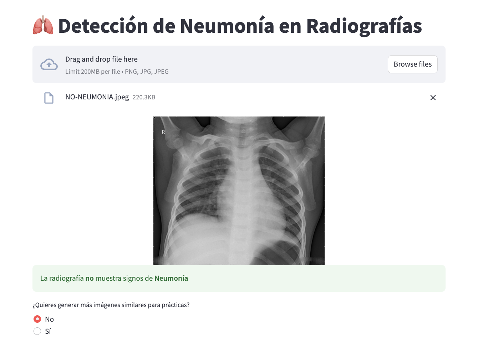
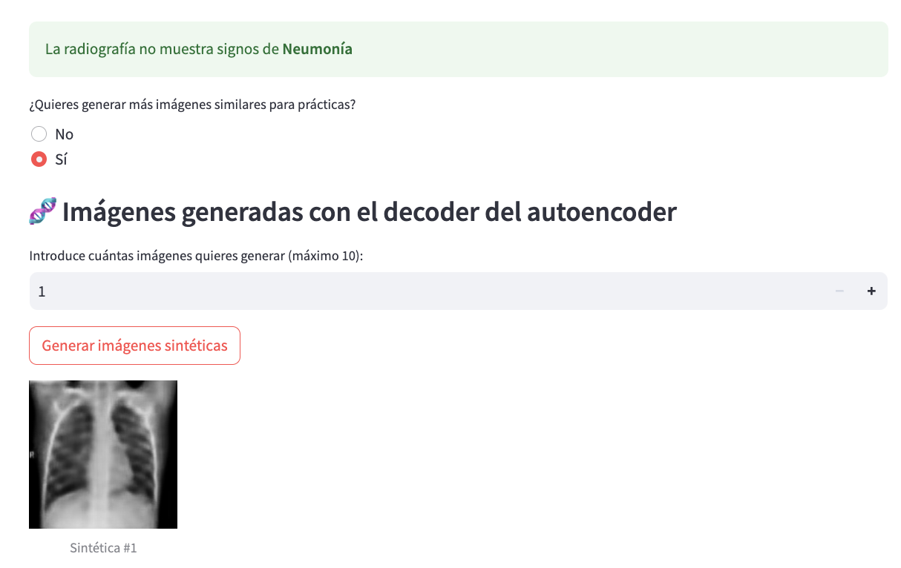

# **Unstructured Data course**

# **Text project**

## ** Pneumonia Detection**

This project uses Computer Vision and Deep Learning techniques to detect pneumonia in pediatric chest X-rays. By combining classical models, convolutional neural networks (CNNs), transfer learning techniques, and autoencoders, the system is able to accurately classify whether an image shows signs of pneumonia or is normal.

This project was undertaken as part of the Unstructured Data course within the Big Data Master's Degree program at Comillas ICAI University.

The team responsible for the project includes:

| Name                    | Email                           |
| ----------------------- | ------------------------------- |
| Marta Álvarez Fernández | 202402675@alu.comillas.edu      |
| Leticia Cólgan Valero   | leticiacologan@alu.comillas.edu |
| Ana Vera Peña           | 202416868@alu.comillas.edu      |

## **Overview**

The objective is to build a system capable of automatically diagnosing pneumonia from chest X-ray images. We use a publicly available dataset from Kaggle: [https://www.kaggle.com/datasets/paultimothymooney/chest-xray-pneumonia?resource=download]. The dataset includes over 5,800 images across three folders (train, validation, and test), organized into two classes: PNEUMONIA and NORMAL.

We apply medical image processing and machine learning techniques, focusing especially on unsupervised learning using autoencoders trained on normal chest X-rays. This allows the system to reconstruct images and detect anomalies, such as pneumonia, by analyzing the resulting error maps.

We also tested various machine learning and deep learning techniques to detect the disease in X-rays, with the goal of developing a tool to support the work of medical professionals.

## **Goals**

- Classify chest X-ray images into two categories: Pneumonia and Normal.
- Statistically analyze and visualize structural differences between both classes.
- Evaluate different approaches:
  1. Classical models (Logistic Regression, SVM, Random Forest)
  2. Deep neural networks (CNN)
  3. Pretrained models (VGG16)
  4. Autoencoders for anomaly detection

## **Techniques Explored**

- Image preprocessing and exploratory analysis
- Data augmentation to balance class distribution
- Dimensionality reduction (PCA)
- Supervised and unsupervised modeling
- Transfer learning with VGG16
- Autoencoders for reconstruction and anomaly detection
- Evaluation metrics: accuracy, recall, F1-score, confusion matrix, and ROC curv

## **Final Product**

Users can interact with a clean web interface built using Streamlit. The app allows users to:

- Upload chest X-ray images
- Receive a classification (Normal or Pneumonia)
- Generate synthetic chest X-ray images using an autoencoder
- Use the app as a visual aid for medical imaging practice or teaching

### Example: Pneumonia Detection

### Example: Non-detection of Pneumonia

### Example: Image generation

This application has the potential to support diagnostic processes and help users better understand chest radiograph interpretation. It bridges the gap between raw medical imaging and actionable clinical insights through the use of deep learning and synthetic data generation.
